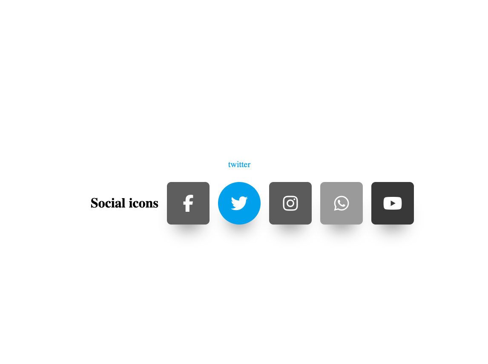

# Social Icons Project

## 📑 Description
Le projet "Social Icons" est une collection dynamique et interactive d'icônes de réseaux sociaux développée pour améliorer l'interface utilisateur en affichant de manière élégante les différents canaux de médias sociaux. Chaque icône réagit au survol par une transformation visuelle et révèle le nom du réseau social correspondant.

## 💻 Technologies Utilisées
- HTML : Structure de base du projet.
- CSS : Mise en forme des icônes et animations. Utilisation de Tailwind CSS pour un design responsive et moderne.
- Font Awesome : Bibliothèque d'icônes pour les logos des réseaux sociaux.
- Google Fonts : Police de caractères "Poppins" pour un rendu esthétique.

## 🔧 Caractéristiques
- **Design Responsive** : S'adapte à différentes tailles d'écran pour une expérience utilisateur optimale sur mobile, tablette et desktop.
- **Effets de Survol** : Chaque icône de réseau social change de couleur et révèle son nom au survol, ajoutant une couche interactive.
- **Facilité d'Intégration** : Peut être facilement intégré à tout site web ou application web en copiant le code HTML/CSS correspondant.

## 👓 Comment Visualiser le Projet
Pour visualiser le projet, clonez ou téléchargez le repository sur votre machine locale. Ouvrez le fichier `index.html` dans votre navigateur web pour voir les icônes de réseaux sociaux en action.

### 🤝 Contribution

Toute contribution est la bienvenue ! Si vous souhaitez contribuer, n'hésitez pas à soumettre une pull request.

## 📫 Contact

Pour toute question ou suggestion, n'hésitez pas à me contacter. semprini.anthony@gmail.com

Try => https://social-icons-css.netlify.app/

